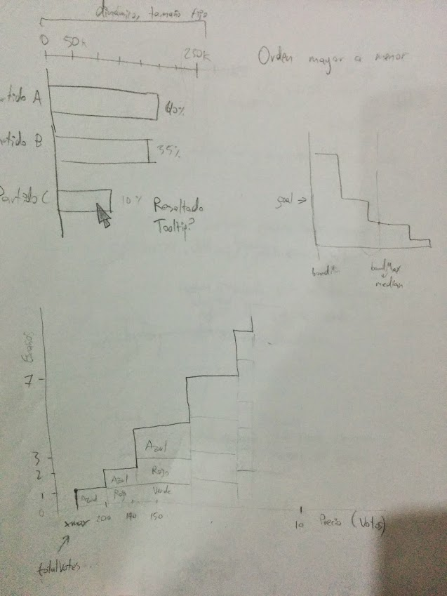

Simulación gráfica del método D'Hondt
=====================================

Esta aplicación trata de explicar de forma intuitiva el funcionamiento del método D'Hondt haciendo uso de visualización de información.

La aplicación puede accederse desde la siguiente URL:

[http://ntrrgc.github.io/dhondt-vis/](http://ntrrgc.github.io/dhondt-vis/)

La aplicación ha sido probada en versiones recientes de Firefox y Chrome en ordenadores de escritorio y en un dispositivo iPad.

Detalles
--------

La aplicación sigue un esquema por diapositivas. En breves textos se introduce al usuario el problema a tratar. Se utiliza la metáfora del precio del escaño (en votos) para explicar cómo se consigue que el reparto sea proporcional. Después se le presenta una herramienta de visualización donde puede ver la evolución de la distribución de escaños en función del precio en votos asignado a cada escaño.

El usuario puede cómo los resultados oscilan según el número de escaños pero tienden a ser cada vez más precisos.

Desarrollo
----------

Buscando explicaciones del método D'Hondt que pudiera entender, después de varios intentos, me encontré con [un artículo de Helen J. Wilson](http://www.ucl.ac.uk/~ucahhwi/dhondt.pdf) en el que explicaba el funcionamiento del método basándose en la metáfora de ponerle precio al escaño. Como objetivo para este proyecto decidí crear una aplicación visual que guiara al usuario por la explicación de éste paper.

En un primer lugar dibujé bocetos de la visualización para descubrir qué podría representar y de qué manera.

Las dimensiones identificadas fueron:

 * Número de escaños.
 * Precio del escaño.
 * Distribución de los escaños entre los partidos.

El siguiente paso fue obtener datos. Para ello tuve que diseñar un algoritmo capaz de encontrar los rangos de precios para cada número de escaños y la distribución de partidos resultante. El algoritmo debía ser lo suficientemente rápido para que se pudiera ejecutar mientras el usuario modifica los datos de entrada arrastrando el ratón.

El algoritmo parte de un precio máximo y mínimo que corresponden a el máximo de votos de un partido y al número de votos respectivamente. A partir de ahí, sabiendo que la función que determina el número de escaños es estrictamente creciente en todo su dominio y crece conforme decrece el precio, se utiliza búsqueda binaria para hallar discontinuidades. En cada paso se debe encontrar un precio que arroje un número de escaños mayor que en el paso anterior, pero tal que el precio inmediatamente inferior (un voto menos) arrojara el mismo número de escaños que los que se obtuvieron en el paso anterior.

Una vez implementado y depurado el algoritmo, procedí a comenzar la implementación de la visualización. Tuve que dedicar un par de días a estudiar D3.js, especialmente para entender cómo se asocian los datos a los elementos visuales y cómo se pueden mantener sincronizados. La naturaleza jerárquica de los datos (los escaños totales se dividen en escaños por partido) dificultó más esta tarea.

Para añadir interacción añadí un gráfico de barras que además de mostrar los votos, permite al usuario modificarlos arrastrando las barras en cualquier dirección. Cada vez que se arrastran las barras, se determina un nuevo número de votos, se recalcula la asignación de escaños y se actualiza la visualización.

Cuando tuve la visualización funcionando me di cuenta de que, aunque parecía útil para explicar el funcionamiento del método, no era tan buena a la hora de mostrar la evolución de la distribución de escaños según se van permitiendo más escaños, ya que la distribución de los rangos de precios no es uniforme.

Para este fin, modifiqué la visualización para que permitiera cambiar la variable del eje X entre precio del escaño o número de escaños. Tuve cuidado de que los elementos del gráfico se mantuvieran constantes de manera que el cambio entre una escala y otra pudiera ser animado.

Consideré útil tener simultáneamente otra visualización alternativa que mostrara la distribución de escaños por partido de forma porcentual. El código sería el mismo que en la visualización anterior cambiando la escala vertical. Para lograr esto reorganicé el código de las visualizaciones en clases (siguiendo el paradigma orientado a objetos).

Teniendo la visualización, hacía falta alguna forma de introducir al usuario en el contexto del problema y explicar qué representaba ésta. Nuevamente boceté diferentes pantallas en las que se explicaría el método.

La implementación final sigue un esquema de presentación de diapositivas, pasando por cada una de las pantallas del boceto hasta llegar a la visualización. Implementé transiciones de desplazamiento entre las páginas.

Antes de dejar al usuario interactuar se muestran globos explicando el significado de la representación. Conforme el usuario cierra los globos desbloquea características, hasta poder hacer uso completo de la herramienta tras unos pocos mensajes.

Los globos aparecen con una animación combinada de caída y *fade in*, y desaparecen con una animacion de *fade out*. Hay un pequeño tiempo desde que un globo desaparece y el siguiente empieza a aparecer para evitar saturar al usuario con estímulos y garantizar así que detecta la aparición del nuevo globo, sin distraerse con el anterior.

Si el usuario cierra las explicaciones accidentalmente puede volver a empezar haciendo clic en *Reiniciar explicación*.

Colores
-------

Los colores empleados en la visualización están escogidos de forma cuidadosa conforme a los siguientes criterios:

* Que no sean demasiado fuertes.
* Que tengan intensidades parecidas entre ellos.
* Que puedan ser distinguidos con facilidad unos de otros.
* Que no recuerden excesivamente a partidos políticos reales.

Después de probar muchas combinaciones, me decanté por la tétrada de rojo, amarillo, verde y azul.

Traté de buscar una combinación de colores que cumpliera todos los criterios y además fuera segura para usuarios daltónicos, sin éxito. En lugar de eso, coloqué una escala de color alternativa para usuarios daltónicos, extraída de [ColorBrewer](http://colorbrewer2.org/), en la que hay variaciones de intensidad más fuertes de lo deseado pero puede distinguirse bien con los tipos de daltonismo más frecuentes. Asigné los colores en un orden tal que, aun en el peor caso en el que sólo se distinguieran dos colores, la alternancia de los mismos permitiera distinguir los partidos.

